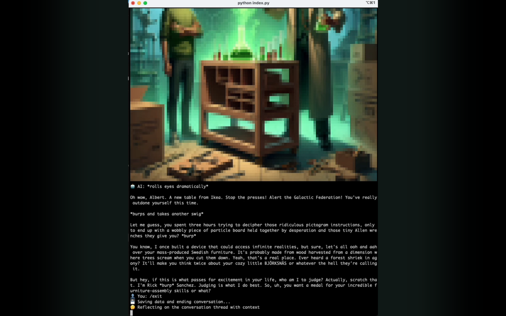

# Rick and Morty AI Agent


This project implements an AI-powered chat game based on Rick from Rick and Morty, with memory management, reflection capabilities, and native voice generation.

Check out the demo video to see the Rick and Morty AI Agent in action:
[](https://www.youtube.com/watch?v=ZAvmPfzkVsA)

This project is part of a Medium blog post series: [Memory Matters: Building an AI Agent with Multi-Layered Memory Systems (Part 2)](https://medium.com/@albert.aleksieiev/memory-matters-building-an-ai-agent-with-multi-layered-memory-systems-part-2-d8215339f10d)

## Prerequisites

Before running the project, make sure you have the following installed:

- Python 3.7+
- Homebrew (for macOS users)

## Installation

1. Clone the repository:
   ```
   git clone https://github.com/albertaleksieiev/RickAndMortyAIAgent
   cd RickAndMortyAIAgent
   ```

2. Install required packages using pip:
   ```
   pip install anthropic openai fakeyou playsound requests python-dotenv
   ```

3. Install additional dependencies using Homebrew (for macOS users):
   ```
   brew install catimg
   ```
**Note: On some Macs, there might be an issue displaying images in zsh. Using iTerm2 as your terminal emulator can resolve this issue.**

## Configuration

1. Set up your environment variables:
   - Copy the `example.env` file to `.env` in the project root directory
   - Edit the `.env` file and add your API keys and credentials:
     ```
     ANTHROPIC_API_KEY=your_anthropic_api_key
     OPENAI_API_KEY=your_openai_api_key
     FAKEYOU_EMAIL=your_fakeyou_email@example.com
     FAKEYOU_PASSWORD=your_fakeyou_password
     ```

2. Obtain API keys:
   - Anthropic API key: Get it from [https://console.anthropic.com/settings/keys](https://console.anthropic.com/settings/keys)
   - OpenAI API key: Retrieve it from [https://platform.openai.com/settings/profile?tab=api-keys](https://platform.openai.com/settings/profile?tab=api-keys)
   - FakeYou (optional): If you want to use Rick's voice, create an account at [FakeYou](https://fakeyou.com/). Note that you may need to set up a payment account. During initialization, FakeYou uses a password for authentication, so use a random password or one that you're not worried about losing. Do not use your real password.

## Usage

Run the main script to start the chat:

```
python index.py
```

Follow the on-screen prompts to interact with the Rick AI chat agent.

## Features

- Conversational AI using Anthropic's Claude model, personified as Rick from Rick and Morty
- Memory management for factual and emotional information
- Reflection capabilities for conversation analysis
- Image generation using DALL-E
- Text-to-speech synthesis using FakeYou
- SQLite database for persistent storage

## Project Structure

- `index.py`: Main entry point and chat loop
- `DatabaseHandler.py`: Manages SQLite database operations
- `MemoryManager.py`: Handles memory storage and retrieval
- `FriendAgent.py`: Implements the main chat agent functionality
- `ReflectionAgent.py`: Provides reflection and analysis capabilities

## Contributing

Contributions are welcome! Please feel free to submit a Pull Request.

## License

This project is licensed under the MIT License - see the [LICENSE](LICENSE) file for details.
